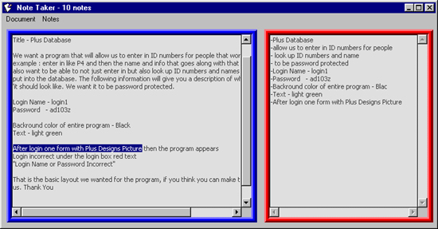



## Ultimate Note Taker

### Description

Note Taker is a small project that demonstrates many useful subs/functions. This project is for anyone who's had to take notes on the computer before. Working between two documents, copying and pasting - it gets tiresome. This takes notes very easily! Load a document, then highlight whatever you want to save as a note. It adds to the notes textbox. Very simple, completely commented. Demonstrates how to load/save files, alphabetize lists, get the number of lines, words, and characters of strings, get the size of any file, as well as demonstrating some easy 3D GUI functions. Any feedback, negative or positive, is greatly appreciated. Please take the time and vote if you find this useful :]
 
### More Info
 

             |
---                |---
**Submitted On**   |2000-11-12 20:32:14
**By**             |[Patrick Moore \(Zelda\)](https://github.com/Planet-Source-Code/PSCIndex/blob/master/ByAuthor/patrick-moore-zelda.md)
**Level**          |Beginner
**User Rating**    |5.0 (15 globes from 3 users)
**Compatibility**  |VB 5\.0, VB 6\.0
**Category**       |[Miscellaneous](https://github.com/Planet-Source-Code/PSCIndex/blob/master/ByCategory/miscellaneous__1-1.md)
**World**          |[Visual Basic](https://github.com/Planet-Source-Code/PSCIndex/blob/master/ByWorld/visual-basic.md)
**Archive File**   |[CODE\_UPLOAD1163211122000\.zip](https://github.com/Planet-Source-Code/patrick-moore-zelda-ultimate-note-taker__1-12749/archive/master.zip)

